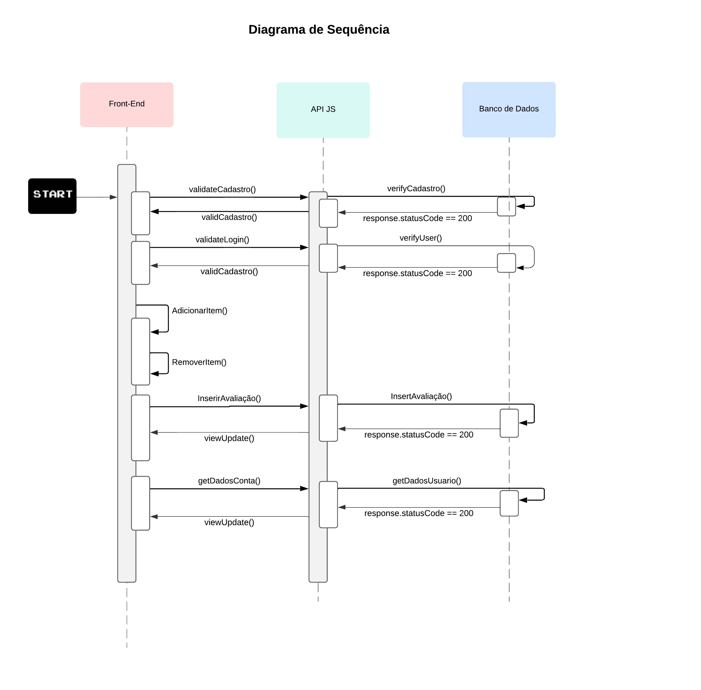

# Trabalho-de-Engenharia-de-Software

Trabalho referente à disciplina Engenharia de Software da UFMG.

# Membros e Papéis:
- Caio Lara (Fullstack)
- José Eduardo Massucato (Fullstack)
- Thales Augusto (Fullstack)

# Escopo:

Com esse trabalho, nosso grupo pretende criar um aplicativo para celulares de uma hamburgueria.
As principais funções do sistema são:

- Criar uma conta para os usuários
- Escolher um lanche do cardápio e adicionar ao carrinho
- Comprar/pagar pelos produtos no carrinho
- Avaliar o restaurante

# Tecnologias:

- Flutter
- Dart
- Javascript
- Node.js
- Express.js
- MongoDB

# Backlog do Produto:

- Como usuário, gostaria de criar uma conta no aplicativo Jose’s Burger*
- Como usuário, gostaria de ver o cardápio do restaurante*
- Como usuário, gostaria de fazer um pedido com mais de um sanduíche ou bebida, por exemplo*
- Como usuário, gostaria de avaliar o restaurante*
- Como usuário, gostaria de efetuar o pagamento pela compra
- Como usuário, gostaria de adicionar créditos ou saldo à minha conta
- Como usuário, gostaria de adicionar usuários como amigos
- Como usuário, gostaria de cancelar pedidos.
- Como proprietário, gostaria de adicionar hambúrgueres ao cardápio
- Como proprietário, gostaria de alterar a tela para modo noturno
- Como usuário, gostaria de ganhar um cupom após fazer vários pedidos

# Backlog do Sprint:

História #1: Como usuário, gostaria de criar uma conta no aplicativo Jose’s Burger.
Tarefas e responsáveis:
- Instalar banco de dados e criar primeiras tabelas [Caio]
- Instalar node.js e Express [Caio]
- Criar e testar uma primeira rota usando o Express [Caio]
- Implementar versão inicial da tela principal [Caio]
- Implementar no backend a lógica de cadastro e login do usuário [Caio]

História #2: Como usuário, gostaria de ver o cardápio do restaurante.
Tarefas e responsáveis:
- Implementar a página principal com a lista de produtos [Thales]
- Implementar, no backend a requisição dos produtos [Thales e Caio]
- Implementar a barra de busca [Thales]
- Implementar a barra de navegação inferior [Thales]

História #3: Como usuário, gostaria de fazer um pedido com mais de um sanduíche ou bebida, por exemplo.
Tarefas e responsáveis:
- Implementar o botão do carrinho [Thales]
- Implementar a página do carrinho de compras [Thales]
- Implementar a função de adicionar ao carrinho [Thales]
- Implementar a função de remover do carrinho [José]
- Implementar o botão de pedir [José]
- Linkar o pedido feito com a aba pedidos [José]

História #4: Como usuário, gostaria de avaliar o restaurante.
Tarefas e responsáveis:
- Implementar o botão de avaliações, que direciona-rá o usuário para a página de avaliações [José]
- Implementar as caixas de texto para avaliações com nome do usuário e data da avaliação [José]
- Implementar a lógica no backend para guardar no banco de dados as avaliações [José]

